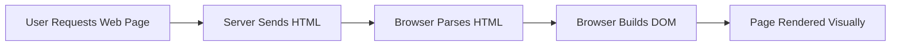

Hey, everyone!  In this guide, we’re going to explore **HTML (HyperText Markup Language)** – the foundational language of the web. HTML is the starting point for building any website or web application. It defines the **structure and content** of web pages. Let’s jump into the basics!

---

## 1. What is HTML?

**HTML** stands for **HyperText Markup Language**. It is not a programming language but a **markup language** used to define the **structure of web pages** using elements and tags.

### Key Features of HTML:


- **Structural Language**:  
  HTML uses **tags** to organize content into sections like headers, footers, paragraphs, and lists. Without HTML, web browsers would not know how to display text and images meaningfully.

- **Semantics**:  
  Modern HTML (HTML5) introduces **semantic elements** like:
  - `<article>` for blog posts or news stories
  - `<section>` for dividing pages into parts
  - `<nav>` for navigation menus  
  These tags add **meaning** to the content, improving SEO and accessibility.

- **Media Integration**:  
  HTML can embed multimedia directly into pages:
  
  ```html
  
  <video controls>
    <source src="video.mp4" type="video/mp4" />
  </video>
- **Linking Content**: Connects multiple web pages using hyperlinks.

:::tip Fun Fact
HTML was created by **Tim Berners-Lee** in 1991, and it laid the foundation for the modern web!
:::

---
## 2. How Does HTML Work?

When a user accesses a web page — whether by typing a URL, clicking a link, or submitting a form — a complex yet seamless process begins behind the scenes. At the heart of this process is **HTML**, which acts as the **blueprint** for building the page in the browser.

### What Happens Behind the Scenes?

1. **User Requests a Web Page**  
   This could be from typing a URL like `www.example.com` or clicking on a link.

2. **Browser Sends a Request to the Server**  
   The browser makes an HTTP(S) request to the web server hosting the website.

3. **Server Responds with HTML (and other files)**  
   The server returns the requested HTML document, along with assets like CSS, JavaScript, and images.

4. **Browser Parses the HTML**  
   The browser reads the HTML file line-by-line and builds a **DOM (Document Object Model)** tree that represents the structure of the content.

5. **Page is Rendered**  
   The browser displays the content on your screen according to the instructions in the HTML, styled by CSS, and made interactive by JavaScript.

---

### HTML Workflow



---

## 3. HTML in Action: Example

Let’s look at a basic HTML document that displays a heading and a paragraph.

```html
<!DOCTYPE html>
<html>
  <head>
    <title>My First HTML Page</title>
  </head>
  <body>
    <h1>Hello, world!</h1>
    <p>This is a simple HTML page.</p>
  </body>
</html>
```

### What’s happening here?
- **`<!DOCTYPE html>`**: Declares the document type (HTML5).
- **`<html>`**: Root element.
- **`<head>`**: Contains metadata and title.
- **`<body>`**: Contains the visible content like text, images, links, etc.

---

## 4. Where is HTML Used?

HTML is **everywhere** on the web. No matter how advanced a website or app looks, its foundation is almost always built with HTML. It’s the **core language** that browsers use to structure and display content.

Below are some of the most common real-world use cases:

---
### 4.1. Web Pages

HTML is the **fundamental building block** of all websites — from personal blogs to massive enterprise portals.

- Every static or dynamic web page starts with HTML to define the page’s structure.
- Tags like `<header>`, `<footer>`, `<main>`, and `<article>` organize the page content.
- Even visually complex designs or animations ultimately rest on HTML structure.

**Example:**  
Landing pages, portfolios, blog articles, homepages, etc.

---
### 4.2. Web Applications

Modern web applications — like Gmail, Google Docs, or Facebook — use HTML in combination with **CSS** (for styling) and **JavaScript** (for interactivity and logic).

- HTML defines the UI layout and containers.
- Components like buttons, input fields, and menus are rendered using HTML elements.
- Frameworks like **React**, **Vue**, and **Angular** use HTML (or HTML-like syntax) under the hood.

**Example:**  
Online banking portals, project management tools (like Trello), e-commerce dashboards, etc.

---
### 4.3. HTML Emails

HTML is used to create **visually rich, styled emails** that go beyond plain text.

- Companies use HTML emails for marketing newsletters, product updates, onboarding emails, and more.
- HTML allows formatting with fonts, colors, images, tables, and buttons.
- Email clients like Gmail and Outlook render these emails based on their HTML code.

**Example:**  
Newsletters, order confirmations, password reset emails, product promotions, etc.

---
### 4.4. Documentation & Help Guides

Many technical documentation sites and help centers are powered by HTML.

- Platforms like **Docusaurus**, **GitBook**, and **Read the Docs** generate HTML from Markdown or custom formats.
- HTML ensures structured, searchable, and user-friendly documentation.

**Example:**  
Developer docs, API references, onboarding guides, FAQs, changelogs, etc.

---

## 5. Writing HTML Code

HTML uses **elements** defined by tags such as `<h1>`, `<p>`, `<div>`, etc. Tags often come in pairs: opening (`<p>`) and closing (`</p>`).

### 5.1. Common HTML Elements

```html
<h1>This is a heading</h1>
<p>This is a paragraph.</p>
<a href="https://example.com">This is a link</a>

```

### 5.2. Best Practices

- Use semantic tags for clarity and accessibility.
- Always close your tags properly.
- Use indentation to enhance readability.
- Add `alt` attributes for images to support screen readers.

---

## 6. Conclusion

HTML is the foundation of all web content. Whether you're building a personal blog or a powerful web app, mastering HTML is the first step. Stick around as we move forward into CSS and JavaScript to bring your pages to life!

---
